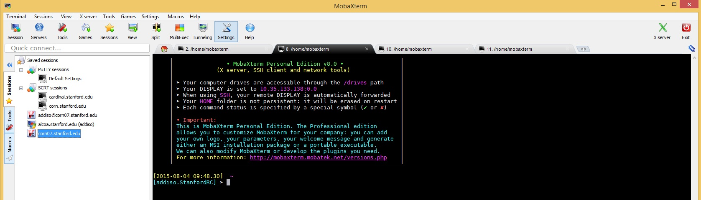
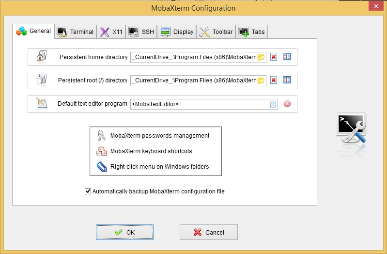
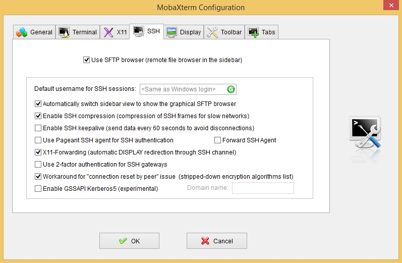

# MobaXterm

We recommend Mobaxterm as an ssh client for Windows users, and it is free for personal use. http://mobaxterm.mobatek.net/

To get started, (this is not required to connect to Farmshare, but makes things a bit more user friendly) let's set up persistent 'home' and 'root' directories. Open MobaXterm and click on the 'Settings' button, or Settings >> Configuration from the top menu bar. 

You should see this window pop up:

Click on the yellow folder icon, and browse to a local folder where you would like to set your persistent home and root directories. This is where files like your ssh keys (if you have them) and other files you add to your create in your root directory will be stored. While we have the configuration window open, let's check out the SSH tab, for additional configuration.

Now in the SSH configuration tab an option for 'Use SFTP browser (remote browser in sidebar)', which is checked on by default. If you do not wish to create a parallel SFTP connection for each session you start, or if you are not using a smartphone with Duo, simply uncheck this box. We will leave this checked for now (since we have the Duo app and can generate new One Time Passcodes (OTP) anytime) to make file transfers to and from the cluster as simple as drag-and-drop. 

The only caveat, is that when connecting to systems that require Two Factor Authentication (TFA) you will be prompted for a second duo code at the time of connection. If you reuse the same code you used to connect to the system, the sftp browser connection will return an error. Open your Duo app and hit the 'generate One time Password' (green key) button to generate a OTP, and enter it when prompted for SFTP browser connection. 

Now that we have taken care of the setup, let's connect to Farmshare. From the MobaXterm home screen, hit enter, or click the 'Start local terminal' button. To reuse a saved session, simply click on the session name from the list displayed on the home screen, or double click on one from the 'Saved sessions' panel on the left. If you started from the "local terminal" just type `ssh <sunetid>@rice.stanford.edu`. 

There is no need to use the -X, or -Y option when ssh'ing, as MobaXterm takes care of all the X11 forwarding auto-magically. If your local machine username is the same as your SUNetID, you can drop the preceding `<sunetid>@` and just 'ssh rice.stanford.edu'. 

After entering your password, you should be greeted with the Duo TFA prompt. If you have a 'Duo' capable device registered at http://accounts.stanford.edu you should see 3 options per device. If you are not using Duo, (requires smartphone and Duo app) you will most likely only have the option for Phone Call or SMS. Select your option, and accept the Duo push (recommended), or enter the OTP that was sent as an SMS or phone call. If you have the SFTP browser enabled, you will see a pop-up asking for `SFTP Browser: Duo login for <sunetid>`. As mentioned above, this is where you will need to generate a key with the Duo app, and type in the OTP to complete the SFTP connection. If successful, you are now connected to a Farmshare machine (riceXX) and should have an SFTP browser panel on the left hand side of the program window. 

To transfer files to Farmshare from you local machine, simply drag and drop the file or directory into the SFTP browser panel. To copy files from Farmshare to your local machine, just drag the file or directory from the SFTP browser window, and drop on your local desktop.
